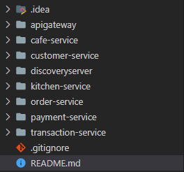
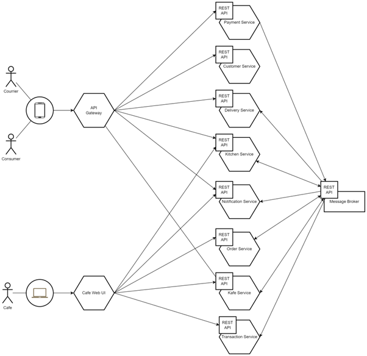

### <b>ETS Pemrograman Perangkat Lunak Berorientasi Objek - 2022/2023</b>

---

Nama: Ihsan Fauzan Hanif\
NIM: 201524011\
Kelas: 3A D4 Teknik Informatika

Dokumentasi Project: [Klik Disini](https://docs.google.com/document/d/1ROC31bRhzpV1mlDWFxzbLG0VXyi_doumuXHkW5tsJZM/edit?usp=sharing)

### <b>Prerequisites</b>

---

- Node Package Manager v16
- Java Development Kit v19
- Postman
- Zookeeper
- Apache Kafka
- Intellij IDEA
- Visual Studio Code

### <b>Installation</b>

---

Pertama, clone repository ini.

```
git clone https://github.com/Zlarex/HasilETSPPLBO2023
```

Install package untuk setiap service dengan menjalankan perintah `npm install` untuk setiap Service yang dibangun menggunakan package Node. Atau dengan perintah `mvn clean install` untuk setiap Service yang dibangun menggunakan package Maven.


Proyek ini memiliki struktur sebagai berikut:\


### <b>Overview</b>

---

#### <b>Services</b>
Microservice adalah arsitektur aplikasi yang memisahkan suatu service utama ke beberapa service yang lebih kecil yang saling berkomunikasi antara satu dengan lainnya. Berikut adalah service yang dibangun  untuk menyelesaikan pembahasan soal ETS:
- Cafe Service
  > Digunakan untuk memanajemen data seputar cafe, seperti nama cafe, waktu cafe dibuka dan ditutup, lokasi cafe yang diidentifikasi melalui latitude dan longitude
- Customer Service
  > Digunakan untuk memanajemen data seputar customer, seperti nama, alamat, username, serta passwordnya.
- Kitchen Service
  > Digunakan untuk mengelola menu cafe serta menanggapi permintaan terhadap tiket yang otomatis dibuat ketika ada order yang masuk. Menu cafe yang disimpan berupa nama, harga, serta kuantitas.
- Order Service
  > Digunakan untuk mengelola pesanan customer, seperti identitas kafe, outlet, customer, kemudian items yang dibelinya di mana terdapat identitas menu, nama, harga, dan kuantitas yang dibelinya.
- Payment Service
  > Digunakan untuk mengelola pembayaran pesanan, kode pesanan harus disajikan pada parameter untuk melihat pesanan atau melakukan pembayaran terhadap pesanan.
- Transaction Service
  > Digunakan untuk menangani seputar data penjualan, statistik, laporan, dan lain sebagainya yang berkaitan dengan pengolahan data penjualan menjadi suatu metrik untuk memberikan wawasan bisnis.
- Service Discovery
  > Setiap service yang ada telah terhubung melalui service discovery menggunakan Eureka, di mana ketika suatu service baru dinyalakan maka secara otomatis akan langsung terhubung dengan service discovery agar service lainnya dapat melakukan komunikasi dengan service ini dengan melakukan lookup terhadap alamat sebenarnya dari service tersebut lalu memulai untuk melakukan request, bahkan ketika alamat yang dituju diinisialisasikan menggunakan random port. Implementasi eureka pada `node.js` dapat terpenuhi menggunakan library `eureka-js-client`.
- API Gateway
  > Untuk mempermudah komunikasi antara client dengan service yang ada di mana memungkinkan service yang memiliki keterkaitan dengan service lain dapat dengan mudah mendapatkan alamat IP dan port (sehingga dinamis dalam menavigasikan permintaan ketika berkomunikasi), maka digunakan API Gateway. Default port untuk API gateway ini adalah `8080`.
- Apache Kafka
  > Untuk mengimplementasikan Producer dan Consumer dalam mendukung kebutuhan `Transactional Outbox Pattern`, maka Kafka digunakan untuk memenuhi peran Message Broker.

#### <b>Design Pattern</b>
Pengimplementasian dari salah satu Transactional Outbox Pattern adalah `Polling Publisher`. Pada proyek ini, order service berperan sebagai polling publisher yang setiap 5 detik sekali melakukan poll terhadap Message Broker dengan mengirimkan data pada Outbox Table, lalu kitchen service melakukan subscribe terhadap Kafka dan memproses data yang diterima darinya.

Implementasi ini untuk menjamin ketika Order Service berhasil digunakan untuk membuat pesanan dan Kitchen Service terdapat kendala yang mengakibatkan tidak dapat berjalan, maka ketika kembali berjalan Kitchen Service akan langsung mendapatkan event yang telah dikirimkan dari Order Service.

Event yang dimaksud adalah ketika customer membuat pesanan, maka Kitchen Service menyimpan data untuk mengetahui apakah cafe menerima atau menolak pesanan.

#### **API Reference**
---
Contoh dari penggunaan API bisa diakses dengan membuka url Postman seperti yang disebutkan pada Docs Dokumentasi
| Method | Endpoint |
| --- | --- |
| **Cafe Service**
| GET | /cafe |
| GET | /cafe/{id_cafe} |
| POST | /cafe |
| PUT | /cafe/id |
| POST | /cafe/{id_cafe}/outlet |
| PUT | /cafe/{id_cafe}/outlet/{id_outlet} |
| DELETE | /cafe/{id_cafe}/outlet/{id_outlet} |
| **Customer Service**
| GET | /customer |
| POST | /customer |
| PATCH | /customer/{id_customer} |
| DELETE | /customer/{id_customer} |
| **Kitchen Service**
| POST | /kitchen/menu |
| PUT | /kitchen/menu/{id_menu} |
| POST | /kitchen/ticket/{order_number}/accept |
| POST | /kitchen/ticket/{order_number}/reject |
| **Order Service**
| POST | /order |
| GET | /order/{order_number} |
| POST | /order/{order_number}/items |
| PUT | /order/{order_number}/items |
| **Payment Service** 
| POST | /payment
| GET | /payment/{order_number}
| POST | /payment//{order_number}/pay
| **Transaction Service**
| POST | /transaction

### **Service Architecture**

---

